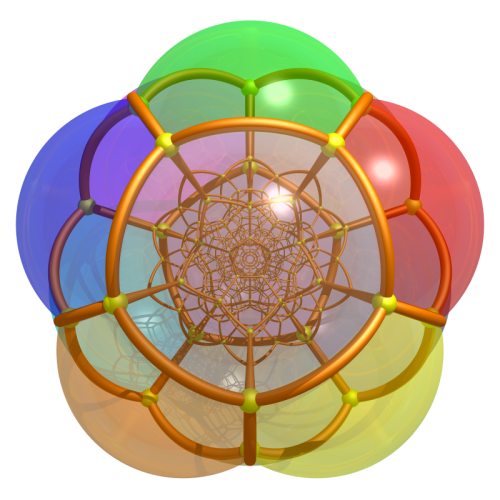
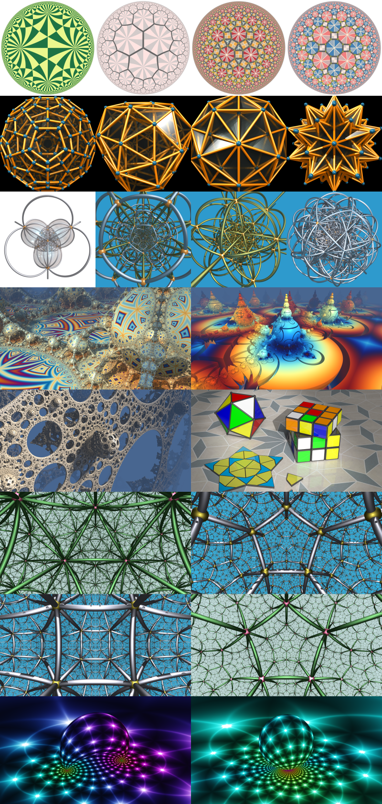

<p align="center">

</p>

# A Tour in the Wonderland of Math with Python

<br>

> #### A collection of python scripts for drawing beautiful figures and animating interesting algorithms in mathematics.

<br>

[](https://travis-ci.org/neozhaoliang/pywonderland)  

<br>


## About this repo

The purpose of this project is to show the beauty of math with python. It consists of several mutually independent subprojects with each one illustrates a special object/algorithm in math. The current list is:

+ [Aperiodic tilings](./src/aperiodic-tilings) like Penrose tiling, Ammann-Beenker tiling, etc.
+ Triology on perfectly random sampling algorithms. See
    1. [Domino shuffling algorithm on Aztec diamonds](./src/aztec)
    2. [Wilson's uniform spanning tree algorithm on 2d grids](./src/gifmaze)
    3. [Coupling from the past algorithm on lozenge tilings](./src/cftp).
+ [Hopf fibration](./src/hopf)
+ [3D and 4D Uniform polytopes](./src/polytopes).
+ [2D and 3d Uniform tilings in Euclidean, spherical and hyperbolic spaces](./src/uniform-tilings).
+ [Make gif animations of various algorithms](./src/gifmaze).
+ [Reaction diffusion simulation with pyglet and glsl](./src/grayscott).
+ [Raymarching fractals with pyglet and glsl](./src/fractal3d).
+ [Raymarching Möbius transformation animations with pyglet and glsl](./src/mobius).
+ [Miscellaneous scripts](./src/misc) like E8 root system, Mandelbrot set, Newton's fractal, Lorenz attractor, etc.

These topics are chosen largely due to my personal taste:

1. They must produce appealing results.
2. There must be some non-trivial math behind them.
3. The code should be as simple as possible.

I'll use only popular python libs and build all math stuff by hand (tools like `sage`, `sympy`, `mathemetica` will not be used here). Also I will only maintain the code for `python >= 3.6`.

**Note**: Python3.5 is deprecated now because it's a bit tricky to install the latest numba on Ubuntu16.04 for python3.5 (if you are using `anaconda` for package management then you need not worry about this because anaconda will fix it for you). Note `numba` is only used in a few fractal scripts in the `misc` directory and all other projects should also work for python>=2.7.

A few examples:

<p align="center">

</p>

## How to use

All projects here are implemented in a read-to-use manner for new comers. That is you can simply run the examples without tweaking any parameters once you have the dependencies installed correctly. Each subdirectory in `src/` is a single program (except that `glslhelpers` is a helper module for running glsl programs and `misc` is a collection of independent scripts), any file named `main.py`, `run_*.py`, `example_*.py` is an executable script that gives some output.


## List of algorithms

Here is a list of some algorithms implemented in this project:

+ [Domino shuffling algorithm](./src/aztec/aztec.py)
+ [Hopcroft's DFA minimization algorithm](./src/uniform-tilings/coxeter/automata.py)
+ [Lempel–Ziv–Welch compression algorithm](./src/gifmaze/gifmaze/encoder.py)
+ [Propp-Wilson's coupling from the past algorithm](./src/cftp/cftp.py)
+ [Todd-Coxeter coset enumeration algorithm](./src/polytopes/todd_coxeter.py)
+ [Wilson's uniform spanning tree algorithm](./src/gifmaze/gifmaze/algorithms.py)
+ [Casselman's minimal roots algorithm](./src/uniform-tilings/coxeter/reftable.py)
+ [Encoding and decoding algorithms for Gray code](./src/gifmaze/example_hilbert_curve.py)

## Dependencies

The recommended way to install all dependencies is simply running the bash script `install_dependencies.sh`.

```
sudo bash install_dependencies.sh
```

Or you can install the python libs by pip:

```
pip install -r requirements.txt
```

Open source softwares required:

+ `python3-tk` (for file dialog)
+ `ImageMagick` (for making gif animations)
+ `FFmpeg` (for saving animations to video files)
+ `POV-Ray` (for generating high quality raytracing results)
+ `graphviz` (for drawing automata of Coxeter groups)
+ `Inkscape` (optional, for convering large svg files to png)

They can all be installed via command-line:

```
sudo apt-get install python3-tk imagemagick ffmpeg povray graphviz inkscape
```


Note `pygraphviz` also requires `libgraphviz-dev`:

```
sudo apt-get install libgraphviz-dev
```

In the scripts these softwares are called in command line as `povray`, `ffmpeg`, `convert` (from `ImageMagick`), etc. For Windows users you should add the directories contain these .exe files to the system `Path` environment variables to let the system know what executables these commands refer to. For example on Windows the default location of POV-Ray's exe file is `C:\Program Files\POV-Ray\v3.7\bin\pvengine64.exe`, so you should add `C:\Program Files\POV-Ray\v3.7\bin` to system `Path` and rename `pvengine64.exe` to `povray.exe`, then you can run the scripts without any changes and everything works fine.

## TODO

I have a long list of projects to do in mind and they may take a few years to accomplish:

+ **Knots**, inspired by [knotilus](http://knotilus.math.uwo.ca/gallery/) but I hope I could do better than that.

+ **Minimal surfaces**. Implement two ways to construct minimal surfaces: either by solving Plateau's problem or use a pair of analytic functions. Render the result in POV-Ray.

+ **Uniform tilings**: Replace the hyperbolic module currently used in `uniform-tilings` project by a custom one, with upper half space model added. Also find an efficient way to render the upper half space boundary images in python. Inspired by [Roice's artwork](https://github.com/roice3/Honeycombs).

+ Shader animations of polyhedral, euclidean, hyperbolic tilings with gears, inspired by [iq' artwork](https://www.shadertoy.com/view/tt2XzG).

+ Escher circle limits in svg format.

+ Shader animation of aperiodic tilings using de Bruijn's approach.

+ Draw limit roots of Coxeter groups.

+ Knots and dynamic systems.

## Thanks

I have learned a lot from the following people:

- [Bill Casselman](http://www.math.ubc.ca/~cass/)
- [Roice Nelson](https://github.com/roice3)
- [Possibly Wrong](https://possiblywrong.wordpress.com/)
- [Jos Leys](http://www.josleys.com/)

## License

see the LICENSE file.