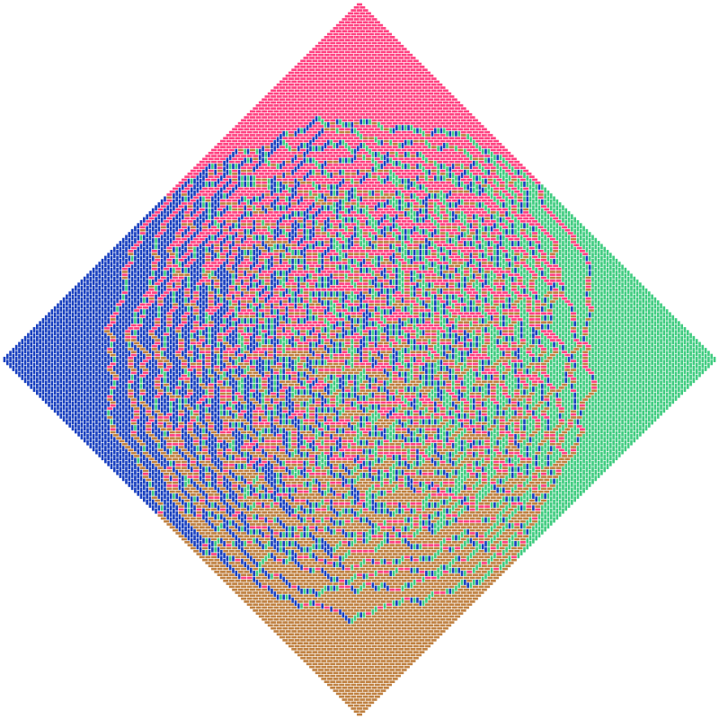

# A Tour in the Wonderland of Math with Python

A collection of python scripts that aimed at rendering beautiful figures or animating interesting algorithms in mathematics.

 

## Contents

- [Mandelbrot Set](#mandelbrot-set)
- [Domino Shuffling Algorithm Animation](#domino-shuffling-algorithm-animation)
- [Icosahedral Kaleidoscope](#icosahedral-kaleidoscope)
- [Newton Fractal](#newton-fractal)
- [The E8 Pattern](#the-e8-pattern)
- [The Modular Group](#the-modular-group)
- [Beauty of Roots](#beauty-of-roots)

---
### Mandelbrot Set
Mandelbrot 集 [[View Code](./src/misc/mandelbrot.py)]

 

 
[[Back to Top](#contents)]

---
### Domino Shuffling Algorithm Animation
多米诺洗牌算法 [[View Code](./src/domino/)] [[Wiki](https://en.wikipedia.org/wiki/Aztec_diamond)]

 

 
[[View Gif Animation](./img/dominoshuffling.gif)]
[[Back to Top](#contents)]

---
### Icosahedral Kaleidoscope

正二十面体万花筒 [[View Code](./src/misc/kaleidoscope.py)]

 

 
[[View Webm Animation](./img/kaleidoscoe.webm)]
[[Back to Top](#contents)]

---
### Newton Fractal
Newton 迭代分形 [[View Code](./src/misc/newton.py)] [[Wiki](https://en.wikipedia.org/wiki/Newton_fractal)]

 

 
[[Back to Top](#contents)]

---
### The E8 Pattern
李代数 E8 的根系 [[View Code](./src/misc/e8.py)] [<a href="https://en.wikipedia.org/wiki/E8_(mathematics)">Wiki</a>]

 

 
[[Back to Top](#contents)]

---
### The Modular Group
模群的基本域 [[View Code](./src/modulargroup.py)] [[Wiki](https://en.wikipedia.org/wiki/Modular_group)]

 

 
[[Back to Top](#contents)]

---
### Beauty of Roots
Littlewood 多项式的根 [[View Code](./src/misc/rootsart.py)] [[Origin](http://www.math.ucr.edu/home/baez/roots/)]

 

 
[[Back to Top](#contents)]

## Dependencies

Python libs:

+ `numpy`
+ `matplotlib`
+ `scipy`
+ `cairo`
+ `palettable`
+ `tqdm`
+ `numba`
+ `pyglet`
+ `vapory`

Softwares:

+ ImageMagick
+ FFmpeg
+ POV - Ray