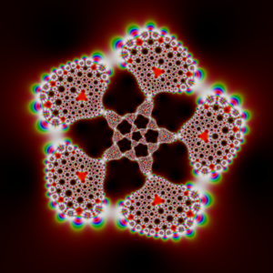
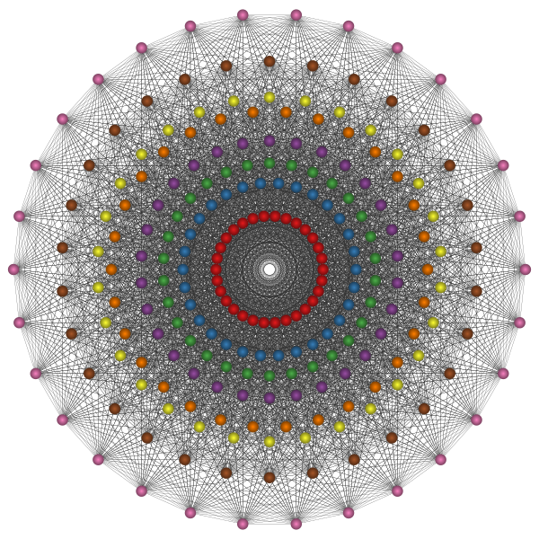
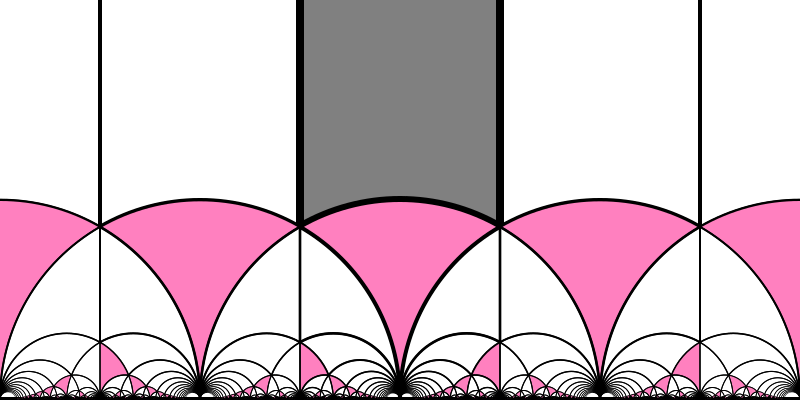
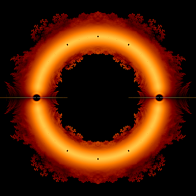
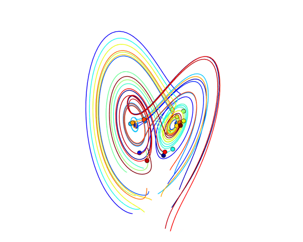

# A Tour in the Wonderland of Math with Python

A collection of python scripts that aimed at drawing beautiful figures or animating interesting algorithms in mathematics.

**This repository will be always under construction as there are too many interesting things in math that can be shown by code.**

  

## Contents

- [Mandelbrot Set](#mandelbrot-set)
- [Domino Shuffling Algorithm Animation](#domino-shuffling-algorithm-animation)
- [Icosahedral Kaleidoscope](#icosahedral-kaleidoscope)
- [Newton Fractal](#newton-fractal)
- [The E8 Pattern](#the-e8-pattern)
- [The Modular Group](#the-modular-group)
- [Beauty of Roots](#beauty-of-roots)
- [Generalized Penrose Tilings](#generalized-penrose-tilings)
- [Wilson Algorithm Animation](#wilson-algorithm-animation)
- [Lorenz Attractor Animation](#lorenz-attractor-animation)

---
### Mandelbrot Set
Mandelbrot 集 [[View Code](./src/misc/mandelbrot.py)]

 

 
[[Back to Top](#contents)]

---
### Domino Shuffling Algorithm Animation
多米诺洗牌算法 [[View Code](./src/domino/)] [[Arctic Cirlce Phenomena](./img/randomtiling.png)] [[Wiki](https://en.wikipedia.org/wiki/Aztec_diamond)]

 

 
[[Back to Top](#contents)]

---
### Icosahedral Kaleidoscope

正二十面体万花筒 [[View Code](./src/misc/kaleidoscope.py)] [[View Webm Animation](./img/kaleidoscope.webm)]

 

 
[[Back to Top](#contents)]

---
### Newton Fractal
Newton 迭代分形 [[View Code](./src/misc/newton.py)] [[Wiki](https://en.wikipedia.org/wiki/Newton_fractal)]

 

 
[[Back to Top](#contents)]

---
### The E8 Pattern
李代数 E8 的根系 [[View Code](./src/misc/e8.py)] [<a href="https://en.wikipedia.org/wiki/E8_(mathematics)">Wiki</a>]

 

 
[[Back to Top](#contents)]

---
### The Modular Group
模群的基本域 [[View Code](./src/misc/modulargroup.py)] [[Wiki](https://en.wikipedia.org/wiki/Modular_group)]

 

 
[[Back to Top](#contents)]

---
### Beauty of Roots
Littlewood 多项式的根 [[View Code](./src/misc/rootsart.py)] [[Origin](http://www.math.ucr.edu/home/baez/roots/)]

 

 
[[Back to Top](#contents)]

---
### Generalized Penrose Tilings
彭罗斯铺砌 [[View Code](./src/misc/penrose.py)] [[Wiki](https://en.wikipedia.org/wiki/Penrose_tiling)]

 

 
[[Back to Top](#contents)]

---
### Wilson Algorithm Animation
Wilson 算法 [[View Code](./src/wilson/)] [[Wiki](https://en.wikipedia.org/wiki/Loop-erased_random_walk)] [[Mike Bostock's Javascript Animation](https://bl.ocks.org/mbostock/11357811)]

 

 

[[Back to Top](#contents)]

---
### Lorenz Attractor Animation
Lorenz 吸引子 [[View Code](./src/misc/lorenz.py)][[View Video](./img/lorenz.mp4)]

 

 
[[Back to Top](#contents)]

## Dependencies

Python libs:

+ `numpy`
+ `matplotlib`
+ `scipy`
+ `cairo`
+ `palettable`
+ `tqdm`
+ `numba`
+ `pyglet`

Softwares:

+ `ImageMagick`
+ `FFmpeg`
+ `POV-Ray`
