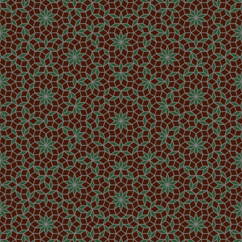

# Draw Generalized Penrose Tilings Using de Bruijn's Pentagrid Method.

Reference:

	"Algebraic theory of Penrose's non-periodic tilings of the plane", N.G. de Bruijn.

## About this program

This project contains two scripts, the one `penrose_cairo.py` uses `cairo` module to draw 2D generalized Penrose tilings, and `penrose_povray.py` uses `POV-Ray` to draw 3D figures. So you need to install this software on your computer.

`POV-Ray`'s own scripting language is not suitable for computing a very complicated world, so a python wrapper would save one's much labor. I used Zulko's `vapory` (which you can download from github or directly install it via pip) here. Don't be afraid of learning this module, its syntex is just a plain translation of POV-Ray's and you will have no difficulty switch between these two.

**Important:** For Windows users you also need to tell `vapory` where your `POV-Ray`'s binary executable is located, see [this issue](https://github.com/Zulko/vapory/issues/18).

## About the math

There is only one Penrose tiling in the sense of "locally isomorphism", but there are infinitely many generalized Penrose tilings which are non-isomorphic with each other. You will see a few different patterns in the following gif:

These two scripts give random patterns each time you run them.

